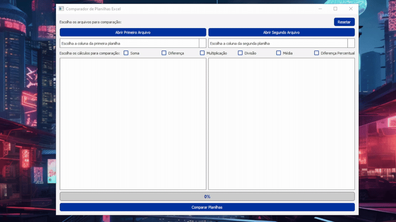
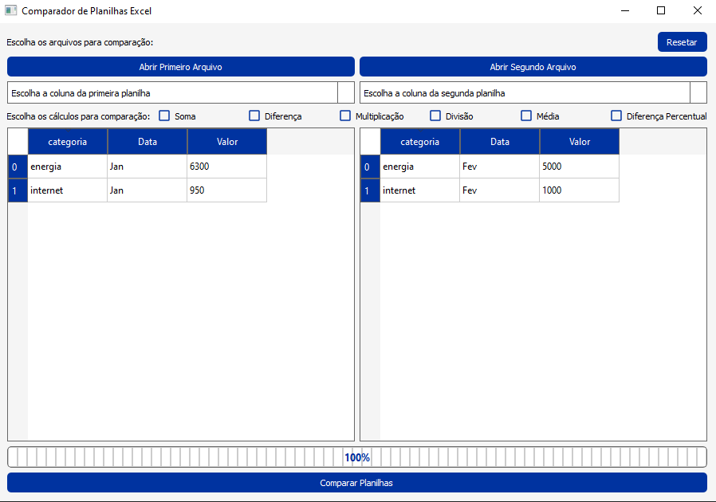
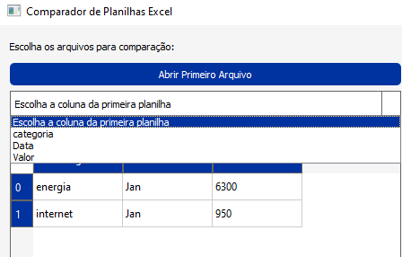
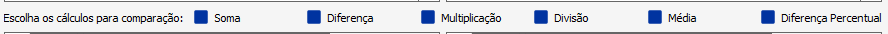
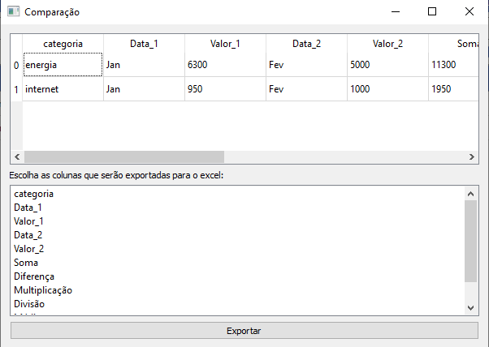
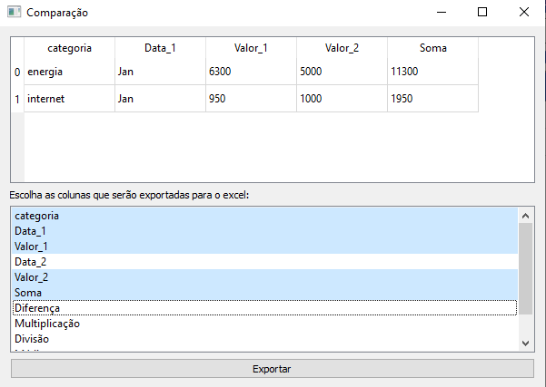
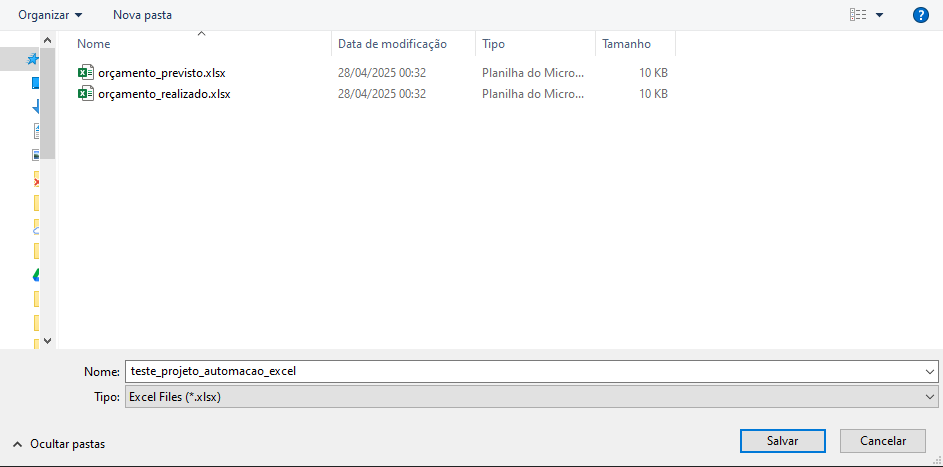
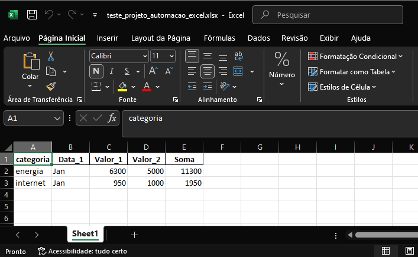

# **Comparador de Planilhas Excel**



Um aplicativo desenvolvido em Python com PyQt5 para comparar planilhas Excel, realizar cálculos personalizados e exibir os resultados de forma clara e intuitiva.

---

## **Funcionalidades**

- **Carregar Planilhas**:



  - Permite carregar duas planilhas Excel para comparação.
  - Exibe os dados carregados em tabelas interativas.

---

- **Lista de colunas para realizar os cálculos**:



  - Após carregar os arquivos, o usuário pode selecionar as colunas de cada planilha que serão usadas como base para os cálculos.
  - O programa permite escolher as colunas específicas de cada planilha.

---

- **Comparação de Dados**:



  - Realiza cálculos personalizados entre as colunas selecionadas:

    - Soma
    - Diferença
    - Multiplicação
    - Divisão
    - Média
    - Diferença Percentual

---

- **Janela de Comparação**:



  - Após a comparação, os resultados são exibidos em uma nova janela.
  - O usuário pode visualizar os dados comparados em uma tabela interativa.

---

- **Selecionar Colunas para Exportação**:



  - Na Janela de Comparação, o usuário pode escolher quais colunas do resultado final serão exportadas.
  - Na lista é permitido selecionar as colunas desejadas.

---

- **Exportar Resultados**:





  - Permite exportar os resultados da comparação para um arquivo Excel ou CSV.

---

## **Tecnologias Utilizadas**

- **Python 3.9+**
- **PyQt5**: Para a interface gráfica.
- **Pandas**: Para manipulação de dados.

---

## **Como Executar o Projeto**

### **Pré-requisitos**
Certifique-se de ter o Python 3.9 ou superior instalado em sua máquina. Instale as dependências do projeto usando o `pip`.

### **Passos**
1. Clone o repositório:
   ```bash
   git clone https://github.com/PedroRBrito/excel-automation.git
   cd excel-automation
